# dodo-box 软件架构文档

> 生成日期: 2026-04-28
> 版本: v0.8.8

---

## 1. 这个软件是干什么的？

**dodo-box** 是一个基于 **Nostr 协议** 的 **隐私优先多账户消息应用**。

### 核心理念

| 特性 | 说明 |
|------|------|
| **去中心化** | 不依赖任何中心化服务器，消息通过 Nostr relay 网络传递 |
| **隐私优先** | 所有消息使用 NIP-59 Gift Wrap 加密，中继无法知道谁在和谁聊天 |
| **多身份** | 一个账户可以创建多个 Nostr 身份（马甲），互不关联 |
| **无密码记忆** | 用用户名+密码派生密钥，不需要记住私钥 |
| **跨平台** | Web 应用 + Capacitor 打包为 Android APK，支持 OTA 热更新 |

---

## 2. 整体架构图

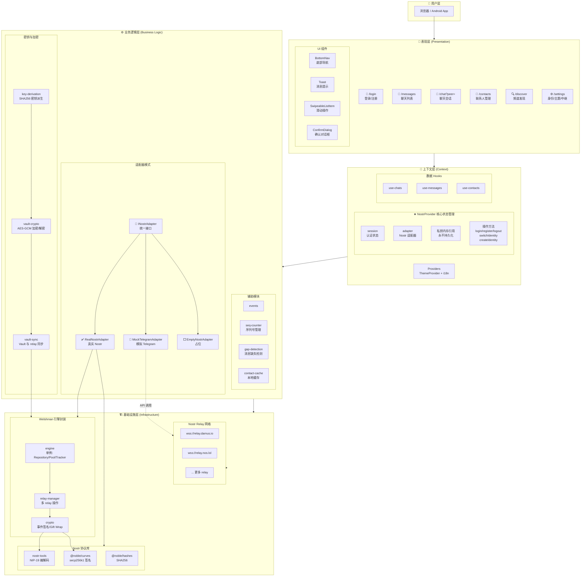

---

## 3. 分层详解

### 3.1 表现层 (Presentation)

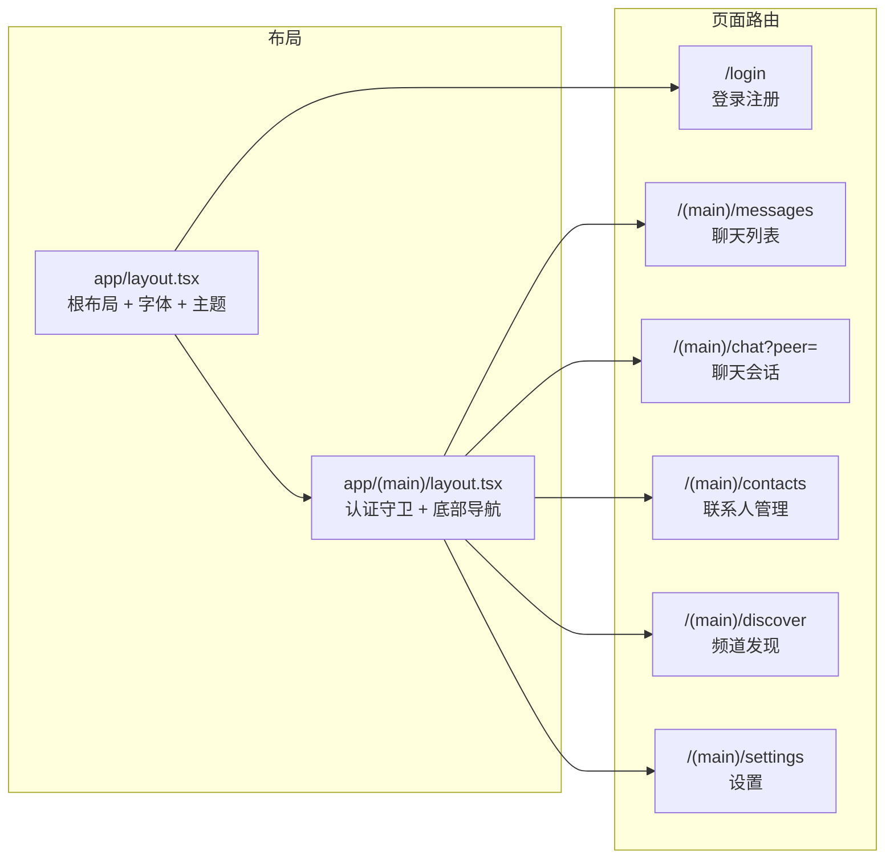

### 3.2 上下文层 (Context)

**NostrProvider** 是整个应用的核心状态管理器：

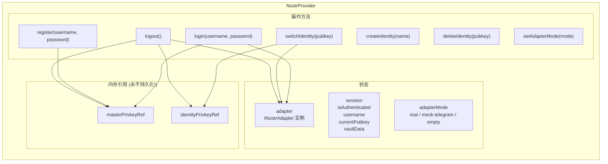

### 3.3 适配器模式 (Adapter Pattern)

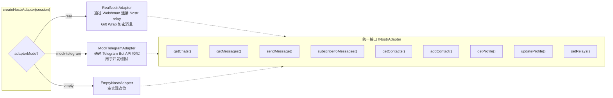

### 3.4 密钥体系

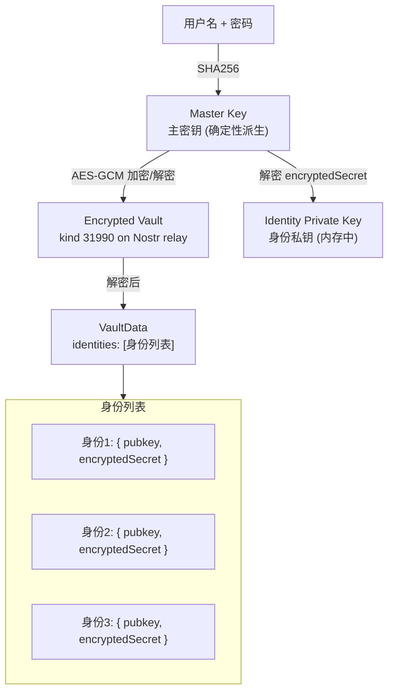

---

## 4. 关键数据流

### 4.1 登录流程

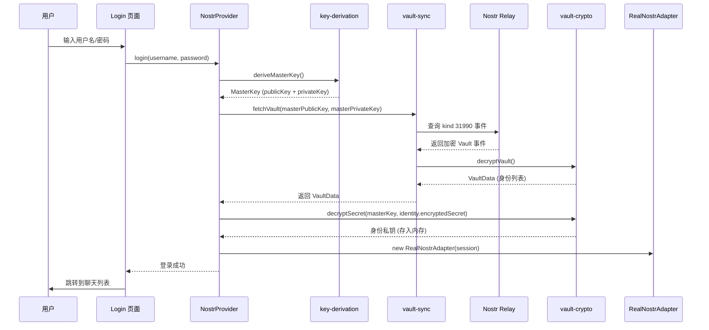

### 4.2 消息发送流程

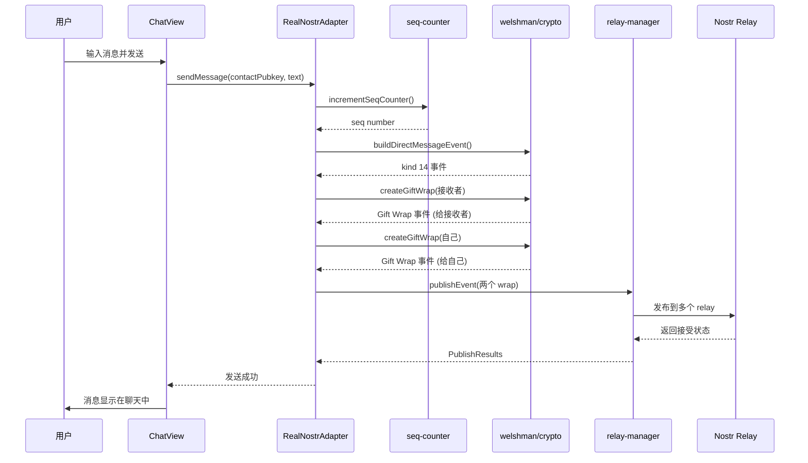

### 4.3 消息接收流程

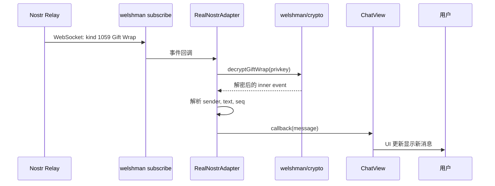

---

## 5. 技术栈总览

| 类别 | 技术 | 版本 |
|------|------|------|
| **框架** | Next.js 15 (App Router) | 15.x |
| **UI** | React 19 + TypeScript 5.9 | 19.x / 5.9 |
| **样式** | Tailwind CSS v4 | 4.x |
| **动画** | Framer Motion (motion) | 12.x |
| **主题** | next-themes | 0.4.x |
| **国际化** | i18next | 25.x |
| **图标** | Lucide React | 0.553 |
| **Nostr 协议** | Welshman 库族 (@welshman/*) | 0.8.x |
| **Nostr 工具** | nostr-tools | 2.x |
| **加密** | @noble/curves + @noble/hashes | 1.x |
| **存储** | localStorage + IndexedDB (idb) | - |
| **移动端** | Capacitor 8 + OTA 更新 | 8.x |
| **AI** | @google/genai (Gemini) | 1.x |
| **表单** | react-hook-form | 5.x |
| **测试** | Vitest + Playwright | 4.x / 1.x |

---

## 6. 安全设计

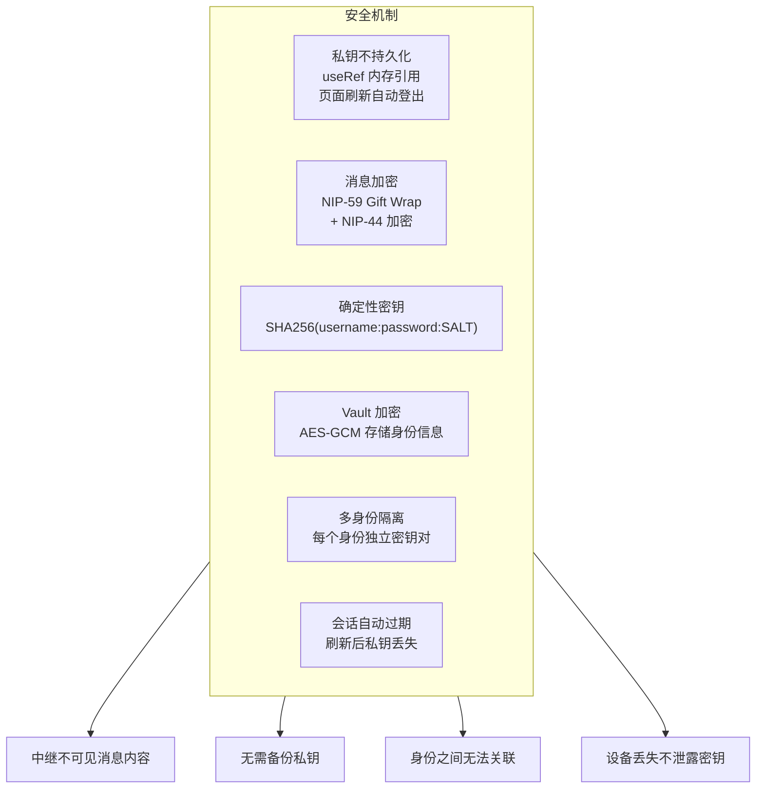

---

## 7. Nostr 事件类型

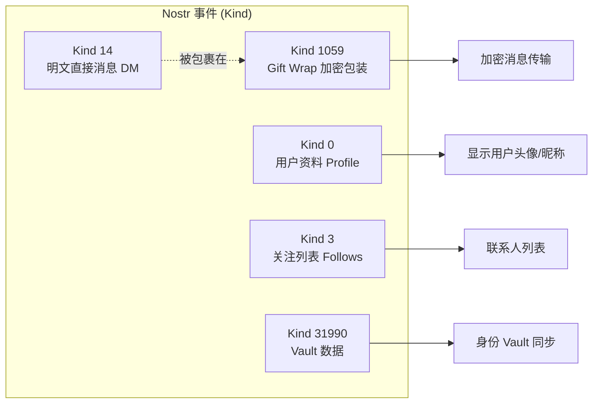

---

## 8. 项目目录结构

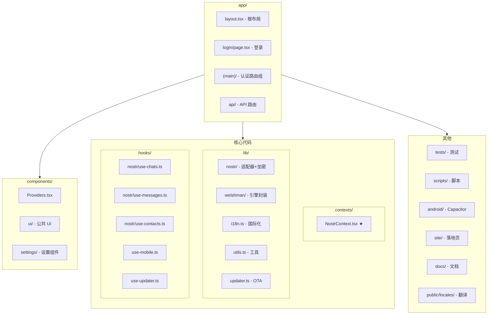

---

## 9. 自定义协议

| 协议 | 格式 | 用途 |
|------|------|------|
| 分享联系人 | `dodobox://contact/<encoded-pubkey>` | 通过 URL 分享 Nostr 公钥 |
| 分享身份 | `dodobox://identity/<encoded-privkey>` | 通过 URL 分享身份信息（含昵称） |

---

*文档生成时间: 2026-04-28*
